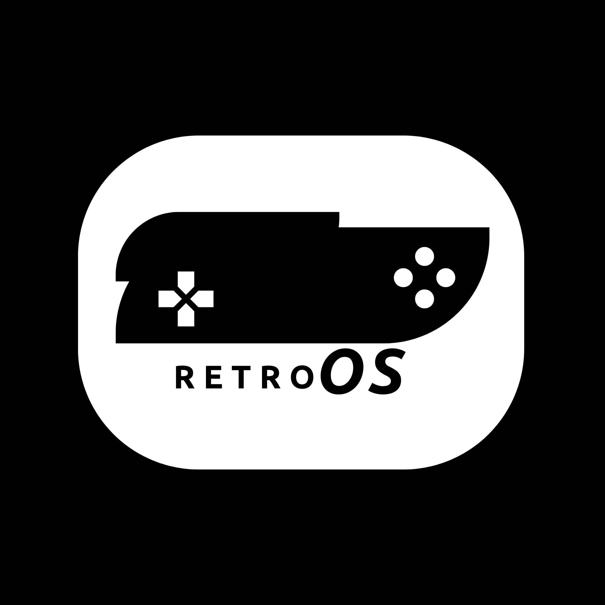
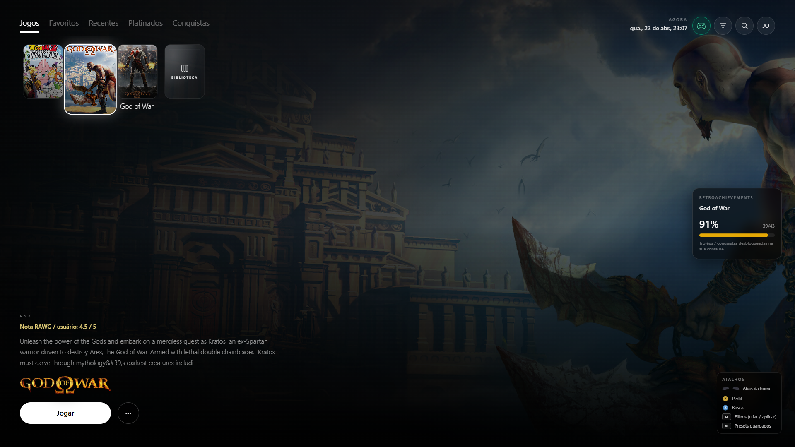
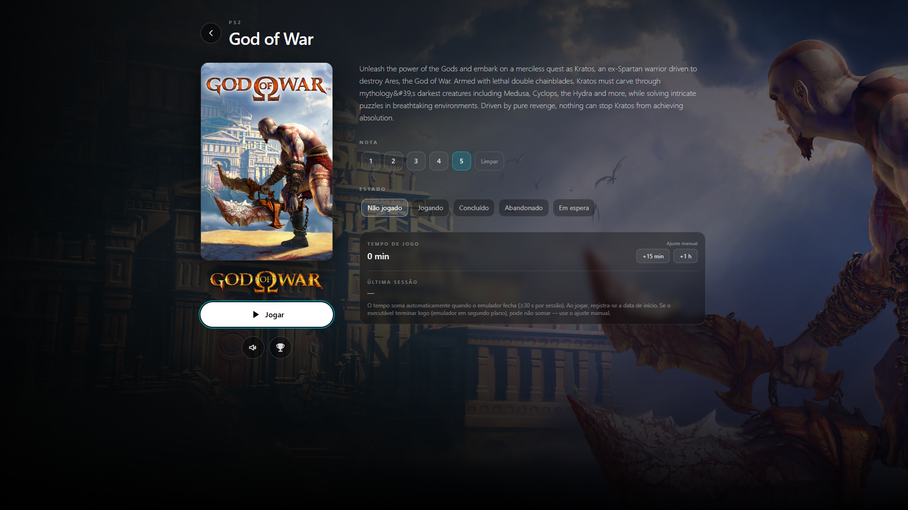
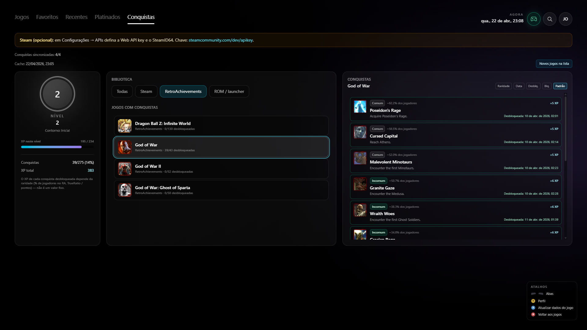

# RetroOS

  

  <strong>Launcher unificado para jogos Steam e retrô</strong> 
  Experiência em tela cheia pensada para jogar no sofá 🎮 
  <em>Uso livre para fins pessoais (não comercial)</em>

  
  
  
  

---

## ✨ Sobre o projeto

O **RetroOS** é um launcher para **Windows** construído com **Tauri + React**, focado em oferecer uma experiência **Big Picture completa**, unificando:

- 🎮 Jogos da Steam  
- 🕹️ Jogos de emuladores (ROMs)  
- 🏆 Conquistas via RetroAchievements  

Tudo isso em uma interface fluida, navegável por controle e otimizada para uso em tela cheia.

---

## 🚀 Funcionalidades

### 🎮 Biblioteca
- Organização automática de ROMs por pasta
- Scan recursivo de arquivos
- Biblioteca dedicada da Steam
- Capas e temas personalizados por jogo

### 🏠 Home (Hub)
- Seções: Todos, Favoritos, Recentes, Platinados
- Sistema de busca e filtros
- Hub de conquistas integrado

### 📄 Detalhes do jogo
- Background dinâmico (imagem/vídeo)
- Tempo de jogo (Steam)
- Conquistas Steam ou RetroAchievements
- Informações e estado do jogo

### ⚙️ Configurações
- Integração com APIs:
  - Steam
  - SteamGridDB
  - RAWG
  - RetroAchievements
- Perfis de usuário
- Som da interface
- Inicialização com o Windows
- Vídeo de boot

### 🧠 Sistema
- Atualizações automáticas dentro do app (Tauri Updater)
- Minimização para bandeja ao iniciar jogos
- Restauração automática ao fechar emuladores/Steam
- Execução segura de processos (evita duplicação)

### 🎨 Personalização
- Temas de botões de controle:
  - Legacy
  - PlayStation (PS5)
  - Xbox
- Interface bilíngue (pt-BR / en)

---

## 🧩 Integrações

- **Steam Web API**
- **RetroAchievements**
- **SteamGridDB**
- **RAWG**

---

## 🖼️ Screenshots

  
  

---

## 🛣️ Roadmap

- [ ] Suporte a outras lojas (Epic, GOG, etc.)
- [ ] Pipeline avançado de identificação de ROMs por hash
- [ ] Sincronização em nuvem
- [ ] Sistema de plugins
- [ ] Melhor suporte a gamepad

---

## 📄 Licença

Este projeto está disponível para uso pessoal e não comercial.

- Uso pessoal é permitido livremente  
- Modificação e estudo do código são permitidos  
- Uso comercial não é permitido sem autorização prévia  

Consulte o arquivo `LICENSE` para mais detalhes.

---

## ⭐ Apoie o projeto

Se você curtiu a ideia, considere dar uma ⭐ no repositório!
